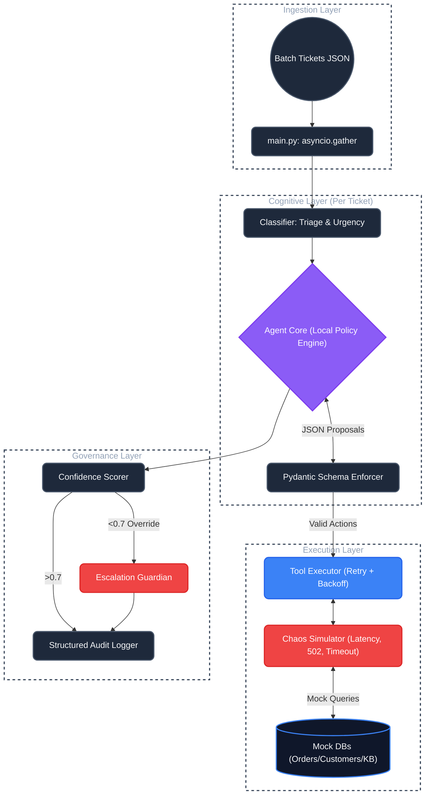

# Tixora-AI


Tixora-AI is ShopWave's autonomous support resolution engine. It processes support tickets using a deterministic Think -> Act -> Observe loop, applies policy checks, and either resolves issues automatically or escalates with full context.

**🌐 Live Demo:** [https://tixora-ai.streamlit.app/](https://tixora-ai.streamlit.app/)

## 🧠 Agent Context
Tixora-AI is designed specifically as a deterministic, autonomous cognitive agent. Unlike standard LLM chatbots that simply reply to user prompts, Tixora-AI operates internally on a rigorous `Think -> Act -> Observe` cycle (ReAct architecture). It acts as an integration layer between unstructured customer problems and structured backend microservices, ensuring that every resolution is backed by concrete tool observations before a final decision is reached.

## 🎯 Primary Use Case
This engine is optimized for **high-volume Support environments** (like E-Commerce or SaaS platforms). By automatically ingesting customer ticket streams, it is able to:
- **Triage and Classify:** Accurately identify incident categories and determine urgency.
- **Act on Corporate Policies:** Issue refunds, execute profile updates, retrieve tracking status, or invoke internal APIs completely manually.
- **Fail Gracefully:** Accurately measure its own decision confidence, guaranteeing that ambiguous, complex, or high-risk tickets are routed to a human specialist instead of risking a hallucinated resolution.

## 🚀 How to Use (System Workflow)
Tixora-AI is deployed as a dual-component engine:
1. **The Batch Orchestrator (`main.py`)**: The primary mechanism that reads the stream of incoming tickets. It governs the concurrency limit, local/API reasoning paths, applies retry/backoff logic to all tools, and commits detailed structured JSON audit trails. 
2. **The Monitoring UI (`ui/app.py`)**: A premium Streamlit dashboard acting as the observer console. It displays reasoning node statuses, decision confidence ratios, and allows you to trace exact "Thoughts" the agent had.

**Workflow:** You load a batch of unstructured JSON tickets into the ingestion stream --> run the pipeline using the Streamlit interface (or CLI) --> the agent processes them concurrently in the background and renders real-time forensic logs. See the Quick Start below.

## Architecture



## Reliability Features

1. Deterministic ReAct execution keeps decision paths predictable and easy to audit.
2. Tickets are processed in parallel using asyncio with a configurable concurrency limit.
3. All tool calls run through a retry wrapper with exponential backoff (0.5s -> 1s -> 2s).
4. Failure simulation covers timeouts, bad gateways, malformed payloads, and partial data.
5. Hard failures are written to a dead-letter queue so the full batch can keep running.
6. Low-confidence resolutions are automatically escalated to a human specialist.

## Quick Start

1. Create a virtual environment

```bash
python -m venv venv
```

2. Activate it

```bash
# Windows
.\venv\Scripts\activate

# macOS / Linux
source venv/bin/activate
```

3. Install dependencies

```bash
pip install -r requirements.txt
```

4. Run the pipeline

```bash
python main.py
```

## Environment Variables

| Variable          | Description                                         | Default |
| :---------------- | :-------------------------------------------------- | :------ |
| `GROQ_API_KEY`    | Optional API key used when `AGENT_MODE=llm`         | `""`    |
| `LOG_LEVEL`       | Logging level (`DEBUG`, `INFO`, `WARNING`, `ERROR`) | `INFO`  |
| `MAX_CONCURRENCY` | Max concurrent ticket workers                       | `5`     |
| `MAX_TICKETS`     | Limit number of tickets (`0` means all)             | `0`     |
| `AGENT_MODE`      | Reasoning backend (`local` or `llm`)                | `local` |

## Operational Commands

```bash
# Run against a custom input file
python main.py data/manual_test_tickets.json

# Launch monitoring dashboard
streamlit run ui/app.py
```

## Docker

```bash
docker compose -f docker-compose.yml up -d --build
```

## File Structure

```text
Tixora-AI/
├── main.py                     # Async batch orchestrator
├── .env.example                # Environment template
├── Dockerfile                  # Container build instructions
├── docker-compose.yml          # Local container orchestration
├── architecture.md             # Detailed architecture notes
├── agent/
│   ├── classifier.py           # Ticket classification
│   ├── confidence.py           # Resolution confidence scoring
│   ├── react_loop.py           # Think -> Act -> Observe loop
│   └── schemas.py              # Pydantic models
├── data/
│   └── tickets.json            # Sample support tickets
├── logs/
│   ├── audit_log.json          # Full execution trace
│   ├── metrics.json            # Runtime metrics output
│   └── dead_letter_queue.json  # Hard-failure records
├── mocks/
│   ├── failure_simulator.py    # Upstream failure simulation
│   └── mock_data.py            # In-memory mock data
├── tools/
│   ├── decision_utils.py       # Shared decision helpers
│   ├── metrics_collector.py    # Runtime metrics aggregation
│   ├── read_tools.py           # Read-side tool implementations
│   ├── tool_executor.py        # Retry, validation, DLQ handoff
│   └── write_tools.py          # Write-side tool implementations
└── ui/
    └── app.py                  # Streamlit monitoring dashboard
```

## Production Standards

1. Minimum evidence depth: each ticket goes through at least 3 tool calls before final decisioning.
2. Structured traceability: every step records thought, action, params, observation, status, and attempts.
3. Defensive tool execution: malformed or partial responses are validated before they reach policy logic.
4. Controlled automation: low-confidence outcomes are escalated with context instead of auto-resolved.
5. Local-first operation: the pipeline runs without external APIs by default.

## Output Artifacts

- `logs/audit_log.json`: full per-ticket execution trace
- `logs/metrics.json`: category and tool-level metrics
- `logs/dead_letter_queue.json`: failure records requiring follow-up
