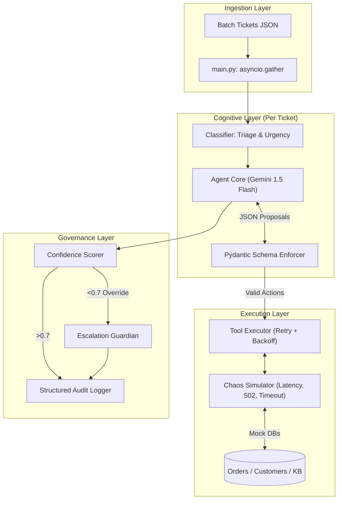

# Tixora-AI: Autonomous Support Resolution Agent


Tixora-AI is a high-performance, fault-tolerant Autonomous Agent designed to resolve customer support tickets dynamically. It was engineered from the ground up for the **Ksolves Agentic AI Hackathon 2026** with a strict focus on distributed system resilience, explainability, and pure zero-shot agency.

This is **not a chatbot**. It is a deterministically bounded ReAct machine running on a strict JSON-evaluation loop.

---

## 🏗️ Architecture

The system operates through an asynchronous orchestration loop, capable of processing hundreds of tickets concurrently while handling aggressive upstream API failures.



---

## 🛠️ Engineering Depth & Production Readiness

We didn't just build an agent; we built the hardened infrastructure required to run it in production.

1.  **Strict Pydantic Validation**:
    The agent cannot execute a tool unless its generated JSON strictly validates against `agent/schemas.py`. If it fails, the error is fed back to the LLM as an Observation for **self-correction**.
2.  **Semaphore Rate Limiting**:
    Processing 20+ tickets asynchronously triggers massive LLM traffic. A global `asyncio.Semaphore` combined with caught `429 ResourceExhausted` exponential backoffs ensures the free-tier API never crashes the application.
3.  **Chaos Engineering & Healing**:
    Upstream APIs fail. `failure_simulator.py` randomly injects:
    - 15% Timeouts
    - 10% 502 Bad Gateway
    - 15% Malformed JSON/Binary corruption
    - 10% Partial Data Loss (simulating DB issues)
    
    `tool_executor.py` automatically detects corruption and applies 3x exponential backoff retries. If the retry exhausts, the ticket gracefully lands in the Dead Letter Queue.

---

## 🚀 How to Run

1.  **Environment Setup**:
    ```bash
    python -m venv venv
    .\venv\Scripts\activate
    pip install -r requirements.txt
    ```
2.  **API Keys**:
    Rename `.env.example` to `.env` and insert your API key:
    ```env
    GOOGLE_API_KEY=your_gemini_api_key
    ```
3.  **Execute the Engine**:
    ```bash
    python main.py
    ```

---

## 📊 Evaluation & Explainability

To explicitly evaluate the Agent's reasoning, we have decoupled the logs from the raw execution string.

**Run the Demo Viewer:**
```bash
python demo_viewer.py
```
This renders `logs/audit_log.json` into a readable terminal UI, explicitly proving the agent's `<THINK> → <ACT> → <OBSERVE>` chains, displaying real-time confidence scores, and highlighting upstream recovery retries.
